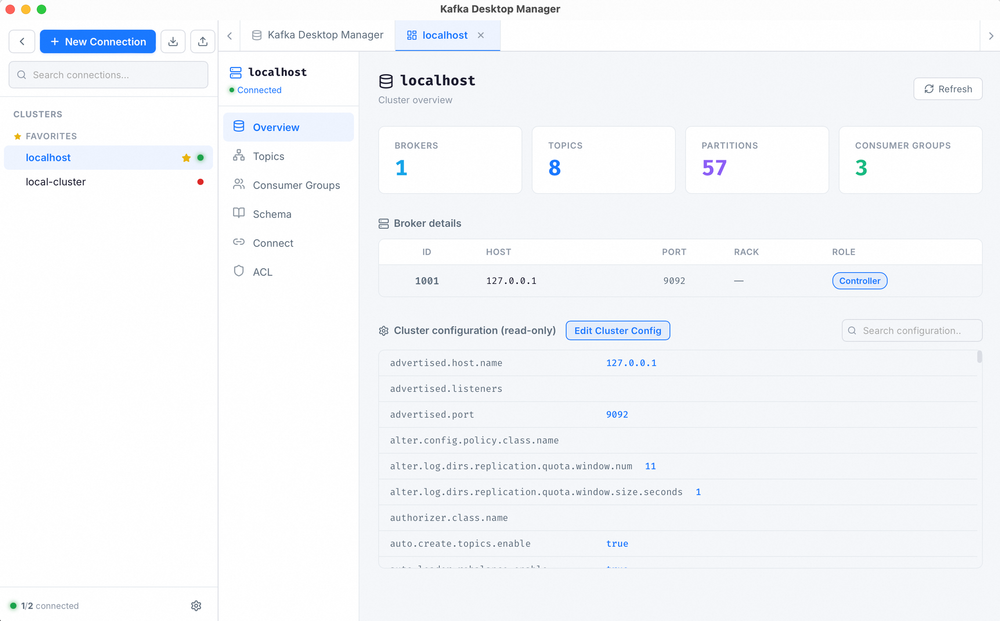

# Kafka Desktop Manager

<p align="center">
  
</p>

<p align="center">
  <b>A modern, cross-platform desktop GUI for Apache Kafka.</b><br/>
  Built with <a href="https://tauri.app">Tauri 2</a>, React 18 and Rust.
</p>

<p align="center">
  <a href="https://github.com/halo-hx/Kafka-Desktop-Manager/actions"></a>
  <a href="https://github.com/halo-hx/Kafka-Desktop-Manager/releases"></a>
  <a href="LICENSE"></a>
  <a href="https://github.com/halo-hx/Kafka-Desktop-Manager/stargazers"></a>
</p>

English | [简体中文](./README.zh-CN.md)

---

## ✨ Features

- **Cluster Management** — Connect to multiple Kafka clusters, inspect brokers, configs and metrics.
- **Topic Operations** — Create / delete / describe topics, browse partitions, tune configs.
- **Message Browser** — Consume, filter, search, send, import & export messages with JSON/Avro/Protobuf support.
- **Consumer Groups** — Inspect lag, reset offsets, manage group state.
- **Schema Registry** — Browse / register / evolve schemas (Avro / JSON / Protobuf).
- **Kafka Connect** — Manage connectors, tasks and their lifecycle.
- **ACL Management** — Create and revoke ACLs with a visual editor.
- **Cross-Cluster Copy** — Copy topic data between clusters in a few clicks.
- **SASL / SSL** — PLAIN, SCRAM, OAUTHBEARER, mTLS and Aiven / Confluent Cloud presets.
- **i18n** — English and 简体中文 built-in.
- **Fast & Lightweight** — Native Rust core, tiny bundle, low memory footprint.

## 📸 Screenshots

<p align="center">
  
  <br/>
  <sub><em>Cluster overview — brokers, topics, partitions, consumer groups, and live configuration at a glance.</em></sub>
</p>

## 📦 Installation

Pre-built binaries are available on the [Releases](https://github.com/halo-hx/Kafka-Desktop-Manager/releases) page for:

- macOS (Intel & Apple Silicon) — `.dmg`
- Windows — `.msi` / `.exe`
- Linux — `.AppImage` / `.deb` / `.rpm`

> **macOS users — first-launch note.** The app is ad-hoc signed but not notarized with an Apple Developer ID, so macOS Gatekeeper will show a warning on first launch. To open the app:
>
> **Method 1 (recommended):** Right-click (or Control-click) the app, select **Open**, then click **Open** in the dialog. You only need to do this once.
>
> **Method 2:** Go to **System Settings > Privacy & Security**, scroll down and click **Open Anyway**.
>
> **Method 3 (Terminal):** If the above methods don't work, run:
> ```bash
> xattr -cr "/Applications/Kafka Desktop Manager.app"
> ```

### Build from source

Prerequisites:

- [Node.js](https://nodejs.org/) ≥ 18 and [pnpm](https://pnpm.io/) ≥ 8
- [Rust](https://rustup.rs/) stable toolchain
- Platform-specific Tauri requirements — see [Tauri prerequisites](https://tauri.app/start/prerequisites/)

```bash
git clone https://github.com/halo-hx/Kafka-Desktop-Manager.git
cd kafka-desktop-manager
pnpm install
pnpm tauri dev      # run in dev mode
pnpm tauri build    # produce a release bundle
```

## 🚀 Quick Start

1. Launch the app.
2. Click **New Connection** and fill in your Kafka bootstrap servers.
3. (Optional) Configure SASL / SSL / Schema Registry.
4. Start exploring topics, messages and consumer groups.

## 🏗️ Architecture

```
┌─────────────────────────────────┐
│  React + Vite (src/)            │   ← UI layer (TypeScript)
│    · Zustand stores             │
│    · Tauri IPC bridge           │
└──────────────┬──────────────────┘
               │  invoke()
┌──────────────▼──────────────────┐
│  Rust + Tauri 2 (src-tauri/)    │   ← Core (async, rdkafka)
│    · commands/ — IPC handlers   │
│    · storage/  — SQLite repo    │
└─────────────────────────────────┘
```

## 🗺️ Roadmap

Short-term goals:

- [ ] Auto-update via Tauri updater
- [ ] Plugin / extension system
- [ ] Kafka Streams & KSQL explorer
- [ ] Dark-mode polish

## 🤝 Contributing

Contributions are very welcome! Please read [CONTRIBUTING.md](./CONTRIBUTING.md) and the [Code of Conduct](./CODE_OF_CONDUCT.md) first.

- 🐛 Report bugs → [Issue tracker](https://github.com/halo-hx/Kafka-Desktop-Manager/issues)
- 💡 Suggest features → open a Feature Request
- 🔒 Report security issues → see [SECURITY.md](./SECURITY.md)

## 📄 License

Released under the [MIT License](./LICENSE).

## 🙏 Acknowledgements

- [Tauri](https://tauri.app) — the framework powering the desktop shell
- [rdkafka](https://github.com/fede1024/rust-rdkafka) — Rust bindings for librdkafka
- [React Virtuoso](https://virtuoso.dev/) — virtualised lists
- All [contributors](https://github.com/halo-hx/Kafka-Desktop-Manager/graphs/contributors) ❤️
